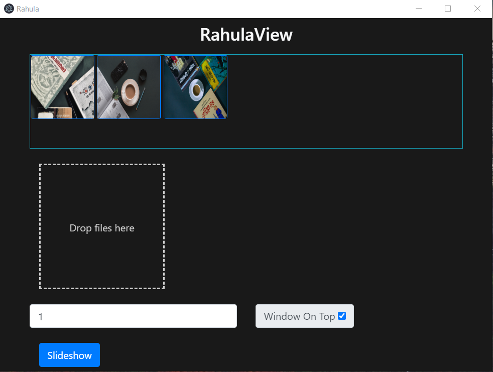

# RahulaView 
***A Photo Slideshow Application | Built with [Electron](https://github.com/atom/electron).***
 
To clone and run this repository you'll need [Git](https://git-scm.com) and [Node.js](https://nodejs.org/en/download/) (which comes with [npm](https://www.npmjs.com/)) installed on your computer. From your command line:

``` bash
# Clone this repository
git clonehttps://github.com/ipritom/RahulaView.git
# Go into the repository
cd RahulaView
# Install dependencies and run the app
npm install && npm start
```

**UI Preview**


